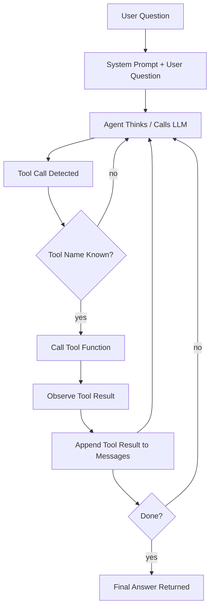

# ReAct Loop for `1_agent_loop_langchain_tool_calling.py`

This document explains the ReAct-style loop used by the e-commerce agent in `1_agent_loop_langchain_tool_calling.py`.

## Agent Loop Overview

The agent follows a ReAct cycle: it thinks, acts by calling a tool, observes the tool result, and repeats until it has a final answer.



## Key Components in the File

- `run_agent(question: str)` is the main loop function.
- `messages` stores the conversation history:
  - `SystemMessage` provides instructions for the agent.
  - `HumanMessage` contains the user question.
  - `ToolMessage` stores tool outputs.
- `llm_with_tools.invoke(messages)` runs the LLM and returns an agent response.
- `ai_message.get_tool_calls()` checks whether the model requested a tool call.
- `tools_dict` maps tool names to Python functions:
  - `get_product_price`
  - `apply_discount`

## Loop Behavior

1. The loop starts with `for i in range(MAX_ITERATIONS):`.
2. The agent sends the current `messages` to the LLM.
3. If the LLM returns no tool calls, the loop ends and the agent returns the final LLM content.
4. If a tool call is present:
   - The tool name and arguments are extracted.
   - If the tool exists in `tools_dict`, the tool is executed.
   - The tool result is appended to the conversation as a `ToolMessage`.
   - The loop continues with the updated message history.
5. If the agent reaches the end of the loop body without returning, it prints an error and returns `None`.

## Why This Is ReAct

- **Reasoning**: The LLM decides which tool to call.
- **Action**: The script executes the requested tool.
- **Observation**: The tool result is returned and appended to the message history.
- **Iteration**: The agent repeats until it can answer directly.

## Example Flow

For the question `What is the final price of a laptop with a gold discount?`:

1. Agent asks `get_product_price(laptop)`.
2. Tool returns `999.99`.
3. Agent asks `apply_discount(999.99, gold)`.
4. Tool returns `699.99`.
5. Agent returns the final answer with the discounted price.

## Execution Steps

1. Activate the virtual environment:

```bash
.\.venv\Scripts\activate
```

2. Create or update `.env` with the following example values:

```env
OOLAMA_MODEL_NAME=llama3
OLLAMA_LOCAL_ENDPOINT=http://localhost:11434
```

3. Run the script:

```bash
python -m 1_agent_loop_langchain_tool_calling
```

4. Watch the console output for the agent iterations, tool call detection, tool results, and the final answer.
